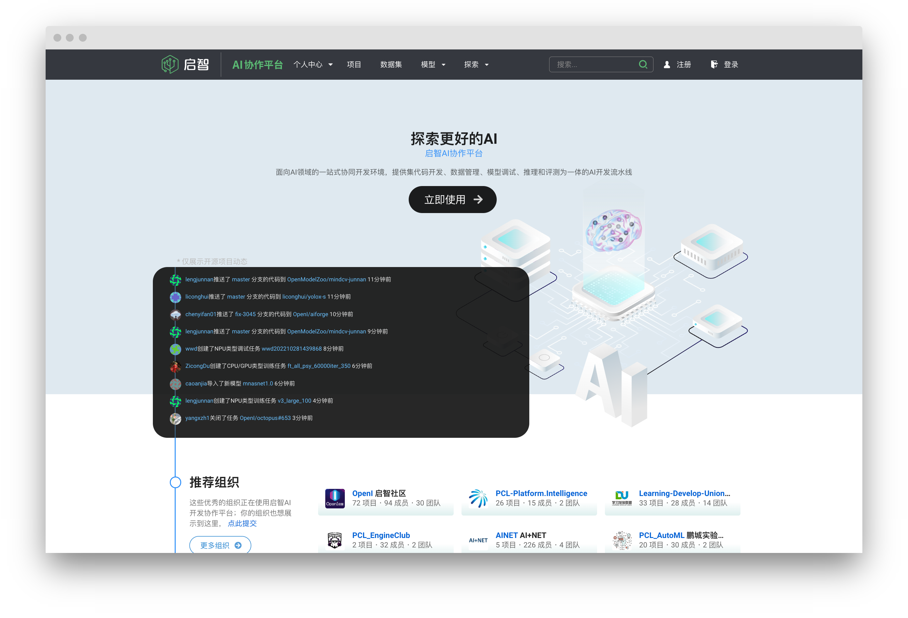

> [!tip| label: 加入我们！|icon:fa-solid fa-envelope fa-bounce]
> 现在就加入启智社区，尽享普惠算力。[立即注册](https://git.openi.org.cn/user/sign_up)

### 平台介绍

> [!note|label:启智社区|icon:fas fa-house]
> `启智AI开发协作平台`，简称 `启智社区` ，是一个开源在线Web应用，旨在为人工智能算法、模型开发提供在线协同工作环境，它提供了代码托管、数据集管理与共享、免费云端算力资源支持(GPU/NPU)、共享镜像等功能。启智社区是基于Gitea发展而来的，我们对其进行了Fork并基于此扩展了人工智能开发中需要的功能，如数据集管理和模型训练等。对于和代码托管相关的功能，您可以参考Gitea的文档。

### 功能介绍

在启智开源社区里，`项目`是基础。你将在`项目`下提交代码，上传数据集，调试代码，创建镜像，训练模型，以及管理模型。

- [代码仓](/repo.md): 代码仓是项目的核心，所有的代码文件都将提交到代码仓。如果你还不熟悉Git操作，可以参考此篇教程。

- [数据集](/dataset.md): 每个项目只能创建一个数据集，但你可以在里面上传多个打包文件。除此之外，你还可以关联多个公开数据集。

- [云脑任务](/cloudbrain.md): 云脑任务包含了多种任务类型。你可以在这里创建属于你自己的镜像，调试代码，以及开启训练或推理任务。

- [模型](/model.md): 在项目中导入模型能让你更好的管理你的模型文件，并快速开始下一次训练或推理任务。

- [个人中心](/user.md): 用户中心里，你能快速查看自己参与的项目，待处理的任务以及所有的云脑任务列表。

###  资源说明

<!-- tabs:start -->

#### **🐶启智集群**
<!-- tabs:start -->
#### **🐶GPU**
| 任务类型 | 卡类型 | 可用镜像 |  网络类型 |数据集处理方式|容器目录说明|
|---------|:-|:------:|:------:|:--------|:------------|
| 调试任务 | T4 |外部公开镜像，如dockerhub镜像；平台镜像；| 能连外网|平台解压数据集| 数据集存放路径/dataset，模型存放路径/model，代码存放路径/code |
| [训练任务](https://git.openi.org.cn/OpenIOSSG/MNIST_PytorchExample_GPU) | V100 |	平台镜像；| 不能连外网|平台解压数据集| 训练脚本存储在 /code 中，数据集存储在 /dataset 中，预训练模型存放在运行参数 ckpt_url 中，训练输出请存储在 /model 中以供后续下载。 |
| [训练任务](https://git.openi.org.cn/OpenIOSSG/MNIST_PytorchExample_GPU) | A100 |外部公开镜像，如dockerhub镜像；平台镜像；| 能连外网|平台解压数据集| 训练脚本存储在 /code 中，数据集存储在 /dataset 中，预训练模型存放在运行参数 ckpt_url 中，训练输出请存储在 /model 中以供后续下载。 |
| [推理任务](https://git.openi.org.cn/OpenIOSSG/MNIST_PytorchExample_GPU/src/branch/master/inference.py)	 | V100 | 平台镜像；| 不能连外网 |平台解压数据集| 数据集存储在 /dataset 中，模型文件存储在 /model 中，推理输出请存储在 /result 中以供后续下载。 |
| [评测任务](https://git.openi.org.cn/OpenIOSSG/aisafety)	 | V100 | 平台镜像；| 不能连外网 |平台解压数据集|  |
>[!warning|label:备注|icon:fa-sharp fa-solid fa-pen]
>启智集群V100不能连外网，只能使用平台的镜像，不可使用外部公开镜像，否则任务会一直处于waiting状态
#### **🐶NPU**
| 任务类型 | 卡类型 | 可用镜像 |  网络类型 |数据集处理方式|容器目录说明|
|---------|:-:|:------:|:------:|:--------|:------------|
| 调试任务 | Ascend 910 | 平台镜像；| 能连外网|平台解压数据集,但需要自己拷贝到容器中。| |
| [训练任务](https://git.openi.org.cn/OpenIOSSG/MNIST_Example) | Ascend 910 |	平台镜像；| 能连外网|平台解压数据集,但需要自己拷贝到容器中。| 数据集位置存储在运行参数 data_url 中，预训练模型存放在运行参数 ckpt_url 中，训练输出路径存储在运行参数 train_url 中。 |
| [训练任务](https://git.openi.org.cn/OpenIOSSG/MNIST_Example) | Ascend 910 |平台镜像；| 能连外网|平台解压数据集,但需要自己拷贝到容器中。| 数据集位置存储在运行参数 data_url 中，预训练模型存放在运行参数 ckpt_url 中，训练输出路径存储在运行参数 train_url 中。 |
| [推理任务](https://git.openi.org.cn/OpenIOSSG/aisafety)	 | Ascend 910 | 平台镜像；| 能连外网 |平台解压数据集,但需要自己拷贝到容器中。|  
<!-- tabs:end -->

#### **🐱智算集群**
<!-- tabs:start -->
#### **🐱GPU**
| 任务类型 | 卡类型 | 可用镜像 |  网络类型 |数据集处理方式|容器目录说明|
|--------------|:-:|:------:|:------:|:--------|:---------|
| [训练任务](https://git.openi.org.cn/OpenIOSSG/MNIST_PytorchExample_GPU/src/branch/master/train_for_c2net.py) | V100 |	外部公开镜像，如dockerhub镜像；平台镜像；| 不能连外网|用户自行解压数据集| 训练脚本存储在 /tmp/code 中，数据集存储在 /tmp/dataset 中，预训练模型存放在运行参数 ckpt_url 中，训练输出请存储在 /tmp/output 中以供后续下载。 |
| [训练任务](https://git.openi.org.cn/OpenIOSSG/MNIST_PytorchExample_GPU/src/branch/master/train_for_c2net.py) | A100 |	外部公开镜像，如dockerhub镜像；平台镜像；| 能连外网|用户自行解压数据集| 训练脚本存储在 /tmp/code 中，数据集存储在 /tmp/dataset 中，预训练模型存放在运行参数 ckpt_url 中，训练输出请存储在 /tmp/output 中以供后续下载。 |
>[!warning|label:备注|icon:fa-sharp fa-solid fa-pen]
>启智集群V100不能连外网，只能使用平台的镜像，不可使用外部公开镜像，否则任务会一直处于waiting状态
#### **🐱NPU**
| 任务类型 | 卡类型 | 可用镜像 |  网络类型 |数据集处理方式|容器目录说明|
|--------------|:-:|:------:|:------:|:---------|:---------|
| [训练任务](https://git.openi.org.cn/OpenIOSSG/MNIST_Example/src/branch/master/train_for_c2net.py) | Ascend 910 |平台镜像；| 能连外网|用户自行解压数据集| 训练脚本存储在 /tmp/code 中，数据集存储在 /训练脚本存储在 /cache/code 中，预训练模型存放在运行参数 ckpt_url 中，训练输出请存储在 /cache/output 中以供后续下载。 |
<!-- tabs:end -->

<!-- tabs:end -->