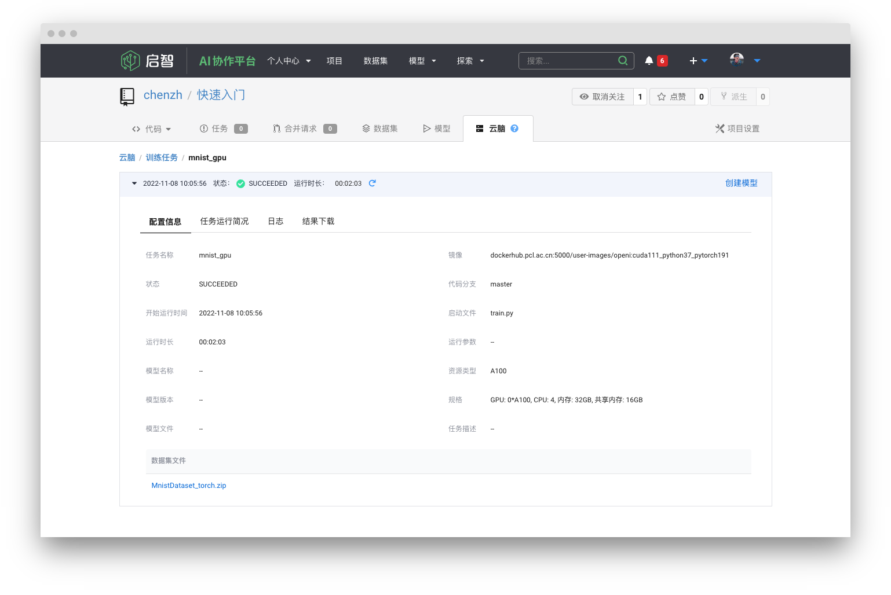
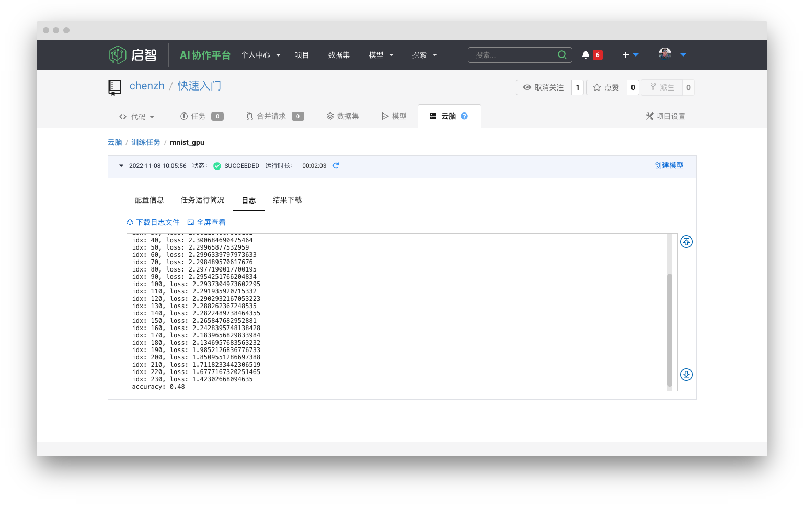
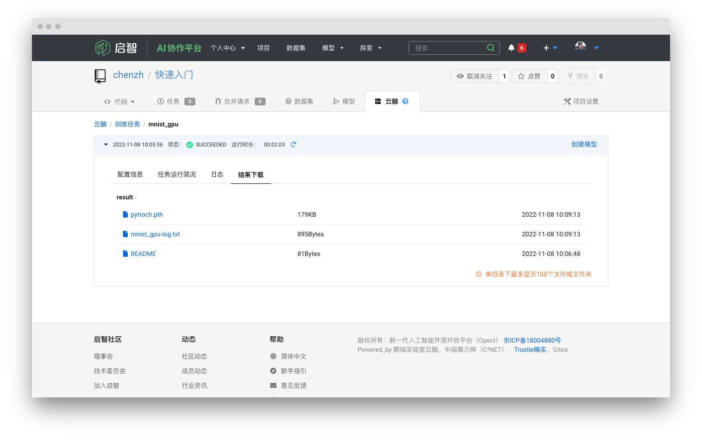

# 快速开始: PyToch手写识别GPU训练任务实例

> 在本篇中，你将快速学会如何创建项目，并开启一个GPU训练任务。

## 创建项目

首先你需要注册一个启智社区的账号。

> [!tip| label: 加入我们！|icon:fa-solid fa-envelope fa-bounce]
> 现在就加入启智社区，尽享普惠算力。[立即注册](https://git.openi.org.cn/user/sign_up)

注册成功之后，在启智平台的导航栏，找到头像旁边的 ➕**创建** 图标，点击 **创建项目** 来新建一个项目代码仓。
<br>
进入创建项目详情界面，填写 **项目名称**，勾选 `初始化储存库` 和 `平台使用协议选项`，点击创建项目。

 

## 代码提交

> [!tip|label:提示|icon:fa-solid fa-bell fa-spin]
> - 你将会在这一步提交或在线创建Python训练代码文件。如果你之前有 **Git** 的使用经验，可以直接克隆代码仓，进行 **Git** 操作。
> - 如果你的 `模型定义` 和 `训练脚本` 在不同的代码文件里，请务必将他们全部提交。
> - `数据集` 将储存到别的位置，请勿将 `数据集` 上传到代码仓。

创建成功之后，来到项目主页。可以看到代码仓里已经默认生成了README描述文件，包含项目名称以及项目描述。

- 点击 **新建文件**，将下面的`示例代码`复制到代码框，并命名为 `train.py` ，点击 **提交变更** 提交代码文件。
- 你也可以在本地创建 `train.py`，然后点击 **上传文件** 或者使用 **Git** 将代码提交至代码仓。


<!-- tabs:start -->

#### **代码仓**

 

#### **示例代码**

``` python
import numpy as np
import torch
from torchvision.datasets import mnist
from torch.nn import CrossEntropyLoss
from torch.optim import SGD
from torch.utils.data import DataLoader
from torchvision.transforms import ToTensor
import argparse
from torch.nn import Module
from torch import nn


class Model(Module):
    def __init__(self):
        super(Model, self).__init__()
        self.conv1 = nn.Conv2d(1, 6, 5)
        self.relu1 = nn.ReLU()
        self.pool1 = nn.MaxPool2d(2)
        self.conv2 = nn.Conv2d(6, 16, 5)
        self.relu2 = nn.ReLU()
        self.pool2 = nn.MaxPool2d(2)
        self.fc1 = nn.Linear(256, 120)
        self.relu3 = nn.ReLU()
        self.fc2 = nn.Linear(120, 84)
        self.relu4 = nn.ReLU()
        self.fc3 = nn.Linear(84, 10)
        self.relu5 = nn.ReLU()

    def forward(self, x):
        y = self.conv1(x)
        y = self.relu1(y)
        y = self.pool1(y)
        y = self.conv2(y)
        y = self.relu2(y)
        y = self.pool2(y)
        y = y.view(y.shape[0], -1)
        y = self.fc1(y)
        y = self.relu3(y)
        y = self.fc2(y)
        y = self.relu4(y)
        y = self.fc3(y)
        y = self.relu5(y)
        return y


# Training settings
parser = argparse.ArgumentParser(description='PyTorch MNIST Example')
#The dataset location is placed under /dataset
parser.add_argument('--traindata', default="/dataset/train" ,help='path to train dataset')
parser.add_argument('--testdata', default="/dataset/test" ,help='path to test dataset')
parser.add_argument('--epoch_size', type=int, default=1, help='how much epoch to train')
parser.add_argument('--batch_size', type=int, default=256, help='how much batch_size in epoch')

if __name__ == '__main__':
    args, unknown = parser.parse_known_args()
    #log output
    print('cuda is available:{}'.format(torch.cuda.is_available()))  
    device = torch.device("cuda:0" if torch.cuda.is_available() else "cpu")
    batch_size = args.batch_size
    train_dataset = mnist.MNIST(root=args.traindata, train=True, transform=ToTensor(),download=False)
    test_dataset = mnist.MNIST(root=args.testdata, train=False, transform=ToTensor(),download=False)
    train_loader = DataLoader(train_dataset, batch_size=batch_size)
    test_loader = DataLoader(test_dataset, batch_size=batch_size)
    model = Model().to(device)
    sgd = SGD(model.parameters(), lr=1e-1)
    cost = CrossEntropyLoss()
    epoch = args.epoch_size
    print('epoch_size is:{}'.format(epoch))
    for _epoch in range(epoch):
        print('the {} epoch_size begin'.format(_epoch + 1))
        model.train()
        for idx, (train_x, train_label) in enumerate(train_loader):
            train_x = train_x.to(device)
            train_label = train_label.to(device)
            label_np = np.zeros((train_label.shape[0], 10))
            sgd.zero_grad()
            predict_y = model(train_x.float())
            loss = cost(predict_y, train_label.long())
            if idx % 10 == 0:
                print('idx: {}, loss: {}'.format(idx, loss.sum().item()))
            loss.backward()
            sgd.step()

        correct = 0
        _sum = 0
        model.eval()
        for idx, (test_x, test_label) in enumerate(test_loader):
            test_x = test_x
            test_label = test_label
            predict_y = model(test_x.to(device).float()).detach()
            predict_ys = np.argmax(predict_y.cpu(), axis=-1)
            label_np = test_label.numpy()
            _ = predict_ys == test_label
            correct += np.sum(_.numpy(), axis=-1)
            _sum += _.shape[0]
        print('accuracy: {:.2f}'.format(correct / _sum))
        #The model output location is placed under /model
        #state = {'model':model.state_dict(), 'optimizer':sgd.state_dict(), 'epoch':epoch}
        torch.save(model, '/model/pytroch.pth')
```

#### **在线创建**

 

 


<!-- tabs:end -->


## 关联数据集

- 在项目中，你可以自行 **上传数据集**，也可以使用社区其他用户 **公开的数据集**。
- 本项目将直接使用官方推荐的 `MNIST-Pytorch` 数据集。

在项目页面，点击 **数据集** -> **关联数据集**，搜索 **MNIST** ，选择 `MNIST_PytorchExample_GPU` 发布的官方推荐版本。

<!-- tabs:start -->

#### **创建关联**


#### **搜索公开数据集**


#### **关联成功**


<!-- tabs:end -->

## 创建训练任务

接下来创建云脑训练任务，在项目里找到 **云脑** -> **训练任务** -> **新建训练任务**。

> [!note|label:训练任务参数填写|icon:fa-solid fa-list]
> - **算力集群** 启智集群
> - **计算资源** CPU/GPU
> - **任务名称** 可自行定义
> - **镜像** *dockerhub.pcl.ac.cn:5000/user-images/openi:cuda111_python37_pytorch191*
> - **启动文件** *train.py*
> - **数据集** *MnistDataset_torch.zip*
> - **资源规格** 默认选择 *GPU:1A100, CPU:4,内存:32GB,共享内存16GB*

<!-- tabs:start -->

#### **创建训练**


#### **参数配置**


#### **镜像选择**


#### **数据集选择**


#### **创建成功**


<!-- tabs:end -->

## 训练完成

当训练任务的状态由 **WAITING** 变为 **SUCCEEDED**，任务训练成功。点击 `任务名称` 查看详情。

<!-- tabs:start -->

#### **配置详情**

你可以查看任务具体配置，包括镜像，数据集，资源规格，运行时间以及脚本文件。



#### **日志查看**

这里是脚本文件中的所有输出打印，也叫做你的 `任务日志`。你可以自行在脚本文件中编辑你输出的信息。`示例脚本` 中打印了训练中每一个 **batch** 的损失，以及模型最终的准确率。



#### **文件下载**

在这里你可以下载在脚本中输出的所有文件以及日志文本。`示例脚本` 里输出了最终的PyTorch模型文件。



<!-- tabs:end -->

